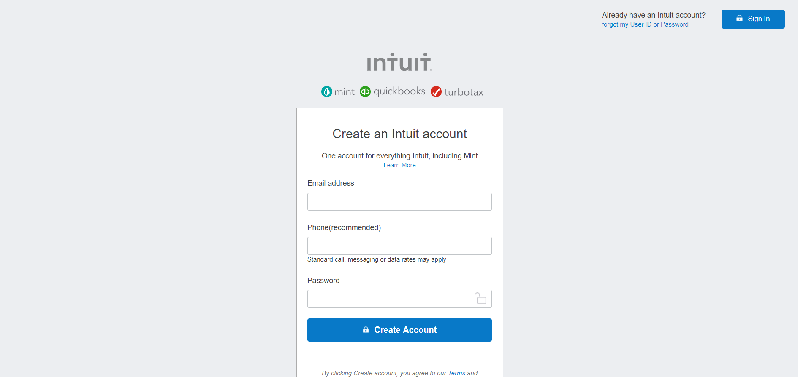

# HTML FORMS ( Mint sign up page clone )

> We created a clone of a Mint's Signup page(https://www.mint.com/), with input form for the creation of a new account.

## Built With

- HTML and css3,

## Live Demo

[Live Demo Link](https://rawcdn.githack.com/Lidya1234/Mint-signup-page/ee7fdf784b933339c3f25a050b79e987fdee4191/index.html)

## Authors

👤 **Khalil Hamdi**

- Github: [@khalilhamdii](https://github.com/khalilhamdii)
- LinkedIn: [LinkedIn](https://www.linkedin.com/in/khalilhamdi/)

👤 **Lidya Ghebreigziabher**

- Github: [@Lidya1234](https://github.com/Lidya1234)
- Linkedin: [LinkedIn](https://www.linkedin.com/in/Lidya/)

## 🤝 Contributing

Contributions, issues and feature requests are welcome! Start by:

Feel free to check the [issues page](issues/).

Forking the project
Cloning the project to your local machine
cd into the project directory
Run git checkout -b your-branch-name
Make your contributions
Push your branch up to your forked repository
Open a Pull Request with a detailed description to the development branch of the original project for a review

## Show⭐

Give a ⭐️ if you like
